CUDA Path Tracer
================

**University of Pennsylvania, CIS 565: GPU Programming and Architecture, Project 3**

* Chen Cheng
  * [LinkedIn](https://www.linkedin.com/in/chen-andrew-cheng-34a133229/), [GitHub](https://github.com/ischencheng)
* Tested on: Windows 11 Home (10.0.26200), Intel Core i5-12500H, 16 GB RAM, NVIDIA GeForce RTX 2050 Laptop GPU 4096 MB (CUDA 13.0, driver 580.97, Visual Studio 2022), personal HONOR GLO-FX6P laptop

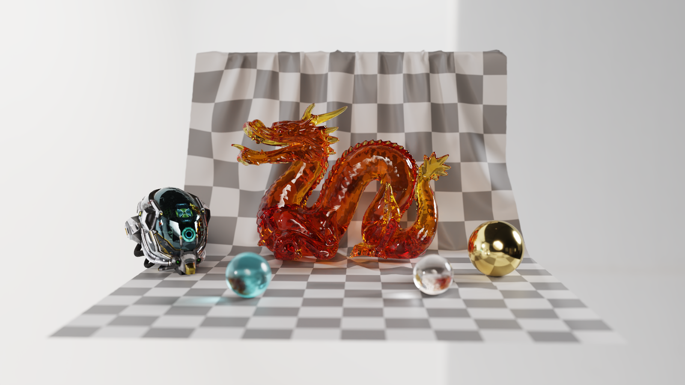

*1600x900, 3000 samples per pixel, path depth 16, denoised with Open Image Denoise. The Stanford dragon is smooth
glass with Beer-Lambert absorption; the helmet is a glTF model with base color, metallic-roughness, normal and
emissive textures; everything is lit by an HDR environment map through next event estimation and multiple
importance sampling. 150k triangles in two BVHs, 49 ms per sample on a laptop RTX 2050.*

A wavefront-style GPU path tracer: every bounce is a sequence of kernels (generate, intersect, optionally regroup
by material, shade + queue shadow rays, trace shadow rays, compact), and every random number is a pure function
of (pixel, sample, dimension), so sorting, compaction, culling and resuming from a checkpoint all leave the image
bit-identical.

## Contents

* [Feature overview](#feature-overview)
* [Gallery](#gallery)
* [Building and running](#building-and-running)
* [Core path tracer](#core-path-tracer): shading, stream compaction, material sorting, antialiasing
* [Making the base pipeline fast](#making-the-base-pipeline-fast)
* [Materials](#materials-refraction-microfacets-and-volume-absorption), [depth of field](#depth-of-field),
  [textures and bump mapping](#textures-normal-maps-and-bump-mapping)
* [Environment lighting, next event estimation and MIS](#environment-lighting-next-event-estimation-and-mis)
* [Low-discrepancy sampling](#low-discrepancy-sampling-owen-scrambled-sobol), [motion blur](#motion-blur)
* [glTF / OBJ meshes and the BVH](#gltf--obj-meshes-and-the-bvh)
* [Russian roulette](#russian-roulette), [wavefront material queues](#wavefront-material-queues),
  [denoising](#denoising-with-open-image-denoise), [restartable rendering](#restartable-rendering)
* [Validation](#validation), [Bloopers](#bloopers), [Credits](#credits-and-references)

## Feature overview

| Area | Feature |
|---|---|
| Core | Lambertian and perfect specular BSDFs, stream compaction (thrust / CUB / adaptive), material sorting (four strategies), stochastic antialiasing |
| Materials | Dielectrics with exact Fresnel (smooth and rough GGX transmission), GGX conductors with VNDF sampling, glTF metallic-roughness, Beer-Lambert absorption |
| Camera | Thin-lens depth of field, motion blur (per-path shutter time) |
| Textures | glTF and file image textures (CUDA texture objects), normal mapping, procedural checker / marble / wood / noise, procedural bump mapping |
| Lighting | HDR environment maps with importance sampling, next event estimation for sphere / cube / triangle lights, multiple importance sampling |
| Sampling | Owen-scrambled Sobol (Burley 2020) vs hashed white noise |
| Geometry | glTF 2.0 and OBJ loading, binned-SAH BVH per mesh with toggleable BVH and bounding box culling, instancing |
| Performance | Inlined device code + CUB (115 ms -> 8 ms), adaptive compaction, Russian roulette, wavefront material queues with template-specialized shading kernels |
| Tools | Intel Open Image Denoise (CUDA device, albedo + normal guides), restartable rendering with self-contained checkpoints, headless benchmark mode, BVH cost heatmap, albedo/normal views |

## Gallery

<p align="center">
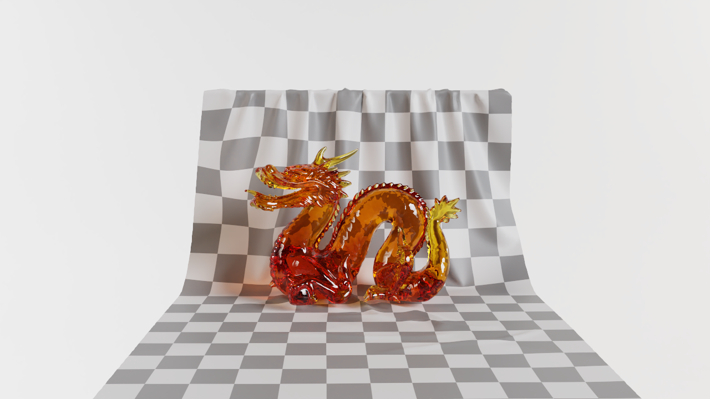
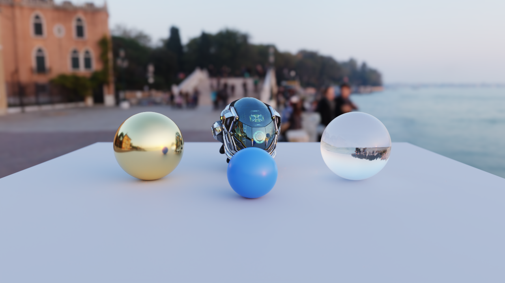
</p>
<p align="center">
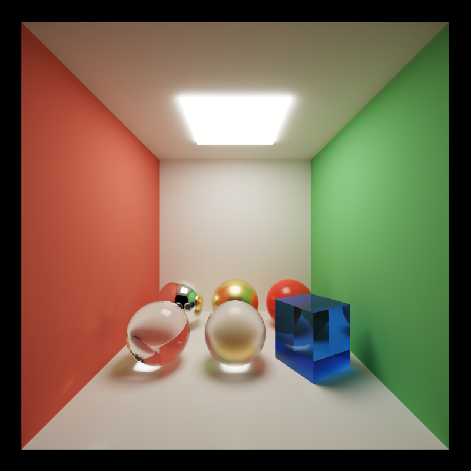
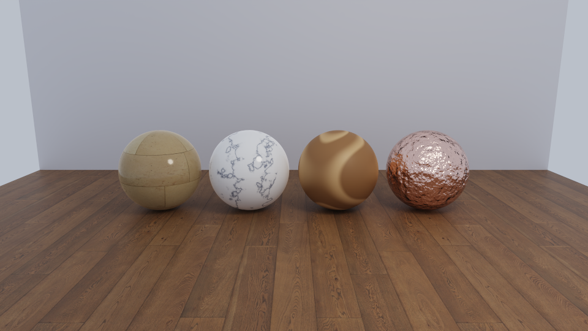
</p>

*Top: the Khronos DragonAttenuation glTF (135k triangles, glass with volume absorption) in a studio HDRI, and
environment-only lighting from a Venice sunset with depth of field. Bottom: the material set in a Cornell box, and
image vs procedural textures with normal and bump mapping. All 3000-4000 spp, ACES tone mapping, denoised.*

## Building and running

The project builds with the provided CMake setup (CMake 3.24+, CUDA 13.0, Visual Studio 2022 on Windows):

```
cmake -S . -B build
cmake --build build --config Release
build/bin/Release/cis565_path_tracer.exe scenes/cover.json
```

**Open Image Denoise is optional.** Download `oidn-2.5.1.x64.windows.zip` from the
[OIDN releases](https://github.com/RenderKit/oidn/releases/tag/v2.5.1) and unpack it so that
`external/oidn/include/OpenImageDenoise/oidn.h` exists (or set `OIDN_ROOT`). CMake then defines `USE_OIDN`, links
the import library and copies the runtime DLLs next to the executable. Without it the build still succeeds and the
denoiser reports itself unavailable. The binaries are not committed (80 MB unpacked).

Scenes reference their models, textures and HDRIs relative to the scene file, so run from any directory.

### Controls

Esc saves and quits, S saves an image, **P saves a checkpoint**, Space recenters, left/right/middle mouse orbit,
zoom and pan. The ImGui panel exposes every integrator, acceleration, denoiser and display toggle along with
per-stage timings and a live-path histogram.

### Command line

```
cis565_path_tracer SCENE.json|CHECKPOINT.ptstate [options]
  --headless --spp N --depth N --res WxH --out NAME     render without a window and save
  --warmup N --profile --stats FILE                     timing (per-stage timing adds syncs)
  --pfm --save-features --save-bvh-cost                 raw float output, denoiser features, BVH heatmap
  --sort off|thrust|cub|indirect  --wavefront 0|1  --regroup-depth N
  --compact off|thrust|cub  --compact-threshold F
  --nee 0|1 --mis 0|1 --rr 0|1 --rr-depth N --sampler random|sobol --aa 0|1 --motion 0|1
  --bvh 0|1 --cull 0|1 --bvh-leaf N --bvh-depth N --bvh-bins N
  --denoise 0|1 --denoise-aux 0|1 --denoise-prefilter 0|1
  --aperture R --focus D --tonemap linear|reinhard|aces --gamma 0|1 --exposure F
  --save-state --checkpoint N                           restartable rendering
```

### Scene format additions

The JSON format of the base code is extended (all new keys are optional):

* **Materials**: `TYPE` is `Diffuse`, `Specular`/`Metal`, `Refractive`/`Glass`, `PBR` or `Emitting`. New keys:
  `ROUGHNESS`, `METALLIC`, `IOR`, `EMISSIVE` + `EMISSIVE_STRENGTH` (glowing surfaces that still scatter),
  `ABSORPTION` or `ATTENUATION_COLOR` + `ATTENUATION_DISTANCE` (glass volume), `TEXTURE`, `NORMAL_MAP`,
  `NORMAL_SCALE`, `UV_SCALE`, `PROCEDURAL: {TYPE: checker|marble|wood|noise, COLOR2, SCALE}`,
  `BUMP: {STRENGTH, SCALE}`.
* **Camera**: `APERTURE` (lens radius) and `FOCAL_DISTANCE`. As in the base code, `FOVY` is used as the
  half angle (`tan(FOVY)` spans half the image height), which keeps the provided Cornell framing.
* **Objects**: `TYPE: "mesh"` with `FILE` (glTF `.gltf`/`.glb` or `.obj`); `MATERIAL` is optional for meshes and
  overrides the file's materials. `MOTION: [dx, dy, dz]` moves any object during the exposure.
* **Environment**: `COLOR` or `FILE` (equirectangular `.hdr`), `INTENSITY`, `ROTATION` (degrees),
  `SAMPLE_PROB` (probability of sampling the environment instead of area lights; estimated from flux if absent).
* **BVH**: `MAX_LEAF_SIZE`, `MAX_DEPTH`, `BINS`.

New scenes: `cover`, `dragon`, `sunset`, `textures`, `materials`, `motion_blur`, `veach_mis`, `cornell_open`,
`cornell_closed`.

## Core path tracer

All timings below are Release builds on the RTX 2050 laptop GPU (16 SMs, 4 GB, ~96 GB/s), measured headless with
CUDA events after warm-up iterations (`scripts/benchmark.py` reproduces every number; raw CSVs are in
[`analysis/`](analysis)). Stage breakdowns come from separate runs that synchronize after every stage, so their
sum is slightly larger than the unsynchronized total.

### Pipeline

```
generate camera rays (AA jitter, lens, shutter time)
for each bounce:
    intersect        closest hit: flat loop over objects -> per-mesh BVH (object space)
    [regroup]        optional: sort by material / wavefront queues
    shade            emission (MIS weighted), next event estimation -> shadow ray slot, BSDF sample, roulette
    trace shadows    any-hit BVH query, add unoccluded light to the pixel
    compact          drop terminated paths (adaptive)
```

Terminated paths write their radiance straight into the accumulation buffer, so compaction can simply drop them
and no final gather over all pixels is needed. A path never shares its pixel with another path in the same
iteration, so these writes need no atomics.

### Shading kernel: diffuse and perfect specular

The required BSDFs are the Lambertian (`f = albedo / pi`, cosine-weighted sampling so `f cos / pdf = albedo`) and
the perfect mirror. They live in `interactions.h` next to the extended models described later. The provided Cornell
box renders like the reference image (linear tone mapping, 5000 samples; the scene file makes the sphere a mirror):

<p align="center">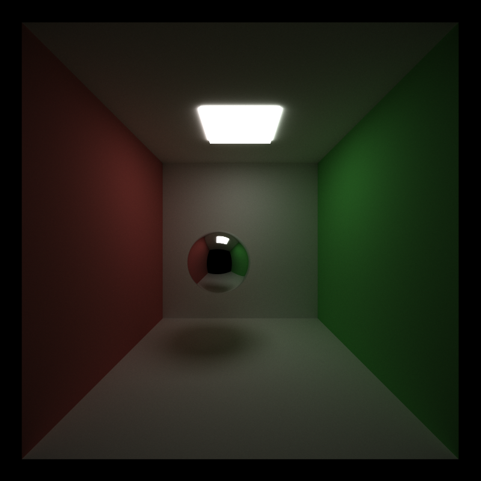 </p>

### Stochastic sampled antialiasing

Each iteration shoots the camera ray through a random point inside the pixel (a 2D sample of the path's own
sampler dimension), so averaging iterations integrates the pixel's box filter. It costs nothing measurable.

<p align="center">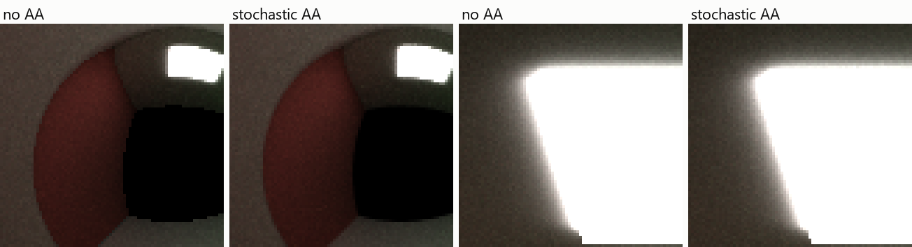</p>

*Sphere silhouette and light corner, one ray through every pixel center vs jittered rays (1000 iterations each,
4x nearest-neighbor zoom).*

### Stream compaction

Paths that miss the scene, hit a light, run out of bounces or are killed by Russian roulette are removed from the
active range between bounces. Three implementations are selectable: `thrust::remove_if`, `cub::DeviceSelect::If`
into a second buffer (pointer swap, scratch memory allocated once at init) and an **adaptive** variant. The
shading kernel counts surviving paths with one warp-aggregated atomic, and the host compacts only when at most
60% of the active range survived; otherwise dead paths simply idle in their warps.

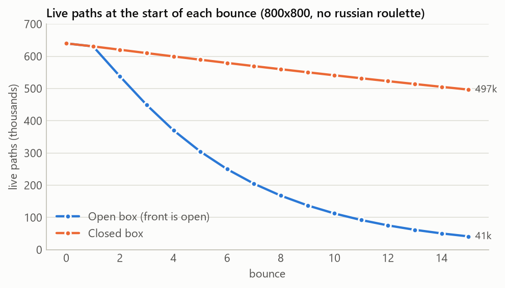

To compare open and closed scenes the camera sits *inside* the Cornell box (`cornell_open.json`); the closed
variant adds the fourth wall behind the camera (`cornell_closed.json`). In the open box paths start escaping
through the open side after their first bounce (16% are gone by bounce 2) and only 6% survive 15 bounces. In the
closed box the only way out is hitting the small light, so 78% are still alive after 15 bounces.

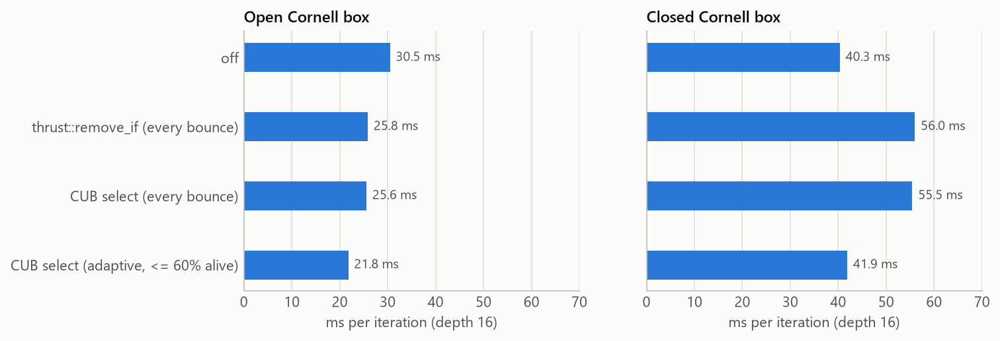

<details><summary>Data: iteration time per compaction mode</summary>

| compaction | open box (ms) | closed box (ms) |
|---|---|---|
| off | 30.5 | 40.3 |
| thrust::remove_if (every bounce) | 25.8 | 56.0 |
| CUB select (every bounce) | 25.6 | 55.5 |
| CUB select (adaptive, <= 60% alive) | 21.8 | 41.9 |

</details>

* **Open box:** compaction is a clear win: intersection and shading launch only for live paths, which more than
  pays for copying them (64-byte path records) every bounce.
* **Closed box:** compacting every bounce is **38% slower** than not compacting. Almost nothing terminates, so
  every bounce copies ~600k path records (2 x 38 MB of traffic) to remove 1-2% of them.
* **Adaptive compaction** gets the best of both: it is 15% faster than compacting every bounce in the open box
  and within 4% of "off" in the closed box (the remaining cost is reading back the live count each bounce).

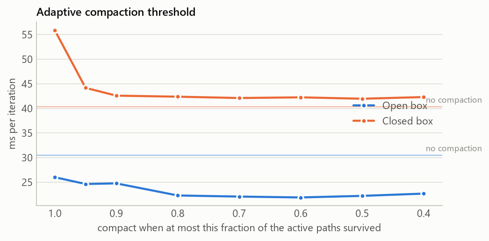

The threshold sweep is flat between 0.5 and 0.8 in both scenes; 0.6 is the default.

**GPU vs CPU.** On a CPU each thread just continues with the next path, so compaction is unnecessary: it exists to
keep GPU warps full. **Further work:** compacting 4-byte path indices instead of 64-byte records would make each
compaction ~10x cheaper, at the cost of indirect (less coalesced) reads in the following kernels; fusing the
compaction into the shading kernel (survivors append themselves to the next buffer) would remove the pass
entirely.

### Sorting paths by material

Different materials take different amounts of time to shade, and a warp whose threads hit different materials
executes every branch. Four ways to make materials contiguous are implemented and compared with the plain
megakernel:

1. `thrust::sort_by_key` of the material ids with a zip iterator over the path and intersection structs;
2. CUB radix sort of (material id, index) pairs, using only `ceil(log2(materials + 1))` key bits, followed by a
   **gather** kernel that physically reorders paths and intersections;
3. the same CUB sort, but the shading kernel **reads through the sorted indices** (no data movement);
4. **wavefront queues** (see [below](#wavefront-material-queues)).

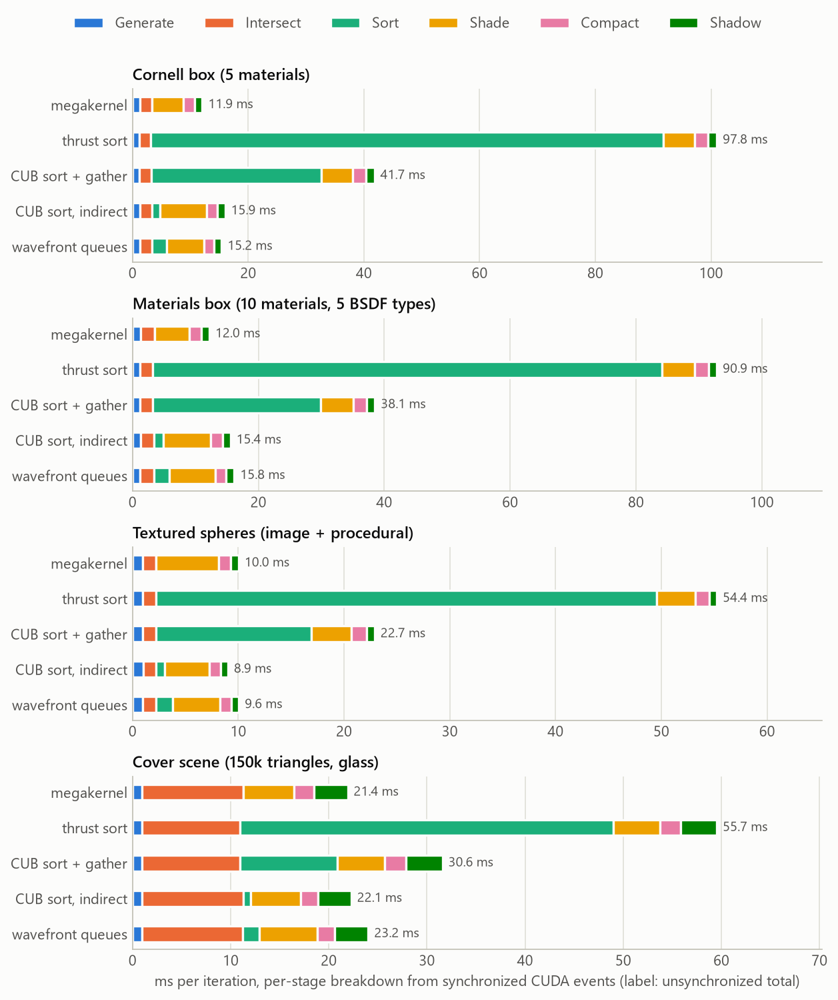

<details><summary>Data: total iteration time and shading kernel time</summary>

| shading strategy | cornell (ms) | materials (ms) | textures (ms) | cover (ms) |
|---|---|---|---|---|
| megakernel | 11.9 | 12.0 | 10.0 | 21.4 |
| thrust sort | 97.8 | 90.9 | 54.4 | 55.7 |
| CUB sort + gather | 41.7 | 38.1 | 22.7 | 30.6 |
| CUB sort, indirect | 15.9 | 15.4 | 8.9 | 22.1 |
| wavefront queues | 15.2 | 15.8 | 9.6 | 23.2 |

| shading kernel time | cornell (ms) | materials (ms) | textures (ms) | cover (ms) |
|---|---|---|---|---|
| megakernel | 5.41 | 5.53 | 5.93 | 5.13 |
| thrust sort | 5.42 | 5.15 | 3.67 | 4.80 |
| CUB sort + gather | 5.42 | 5.15 | 3.77 | 4.78 |
| CUB sort, indirect | 8.04 | 7.54 | 4.24 | 5.12 |
| wavefront queues | 6.41 | 7.24 | 4.46 | 5.97 |

</details>

* **Physically moving the paths dominates everything.** `thrust::sort_by_key` sorts full 32-bit keys and moves
  ~80-byte struct tuples through several radix passes (80-90 ms per iteration). The CUB gather is better but
  still costs 10-30 ms: Nsight Compute showed the gather kernel at 83% of DRAM bandwidth moving ~200 MB per call for
  33 MB of useful data, because neighbouring threads read 40-byte records from scattered addresses.
* **Sorting indices is cheap** (~1 ms per iteration), but shading through the permutation turns coalesced loads
  into scattered ones: in the Cornell and materials scenes the shading kernel gets *slower* (5.4 -> 8.0 ms) even
  though its threads are more coherent. Those scenes are simple: a camera ray's neighbours hit the same object
  anyway, and the BSDFs are cheap compared to the memory traffic.
* **Sorting pays off when materials have very different costs and interleave.** In the textured-spheres scene
  (procedural marble/wood with several noise octaves, normal-mapped image textures, flat walls) the shading
  kernel drops from 5.9 ms to 4.2 ms and the whole iteration gets 11% faster. With the data physically reordered
  the same kernel even reaches 3.7 ms (coherent *and* coalesced), but moving the data costs 15-47 ms. On the
  cover scene index sorting is within 3% of the megakernel.
* Regrouping only from a later bounce (`--regroup-depth`, when camera-ray coherence is gone) recovers part of the
  loss in the simple scenes but never beats the megakernel there.

**GPU vs CPU.** A CPU has no warps, so material coherence matters only for instruction-cache locality; sorting
would be pure overhead. **Further work:** sort by (material, ray direction octant) to also improve traversal
coherence, or make sorting adaptive per scene from the measured shading cost.

## Making the base pipeline fast

The first working version followed the base code's structure and took **115 ms per iteration** on the Cornell
box. Restructuring the kernels took it to **8 ms** (same image, 14x faster):

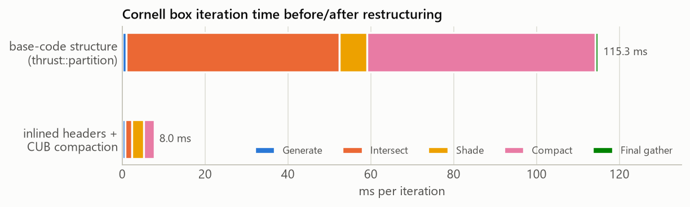

* **Intersection 51.4 ms -> 1.6 ms.** `intersections.cu` and `interactions.cu` were separate translation units
  compiled with relocatable device code, so every box/sphere test was a real call that passed a 232-byte `Geom`
  by value through local memory, and nothing could be inlined. Moving all device code into headers as inline
  functions, transforming rays into object space without renormalizing (so `t` is shared between spaces), and
  storing only `(t, material, geom, primitive, barycentrics)` per hit (attributes are rebuilt for the closest hit
  in the shading kernel) removed nearly all of it.
* **Compaction 55.1 ms -> 2.5 ms.** `thrust::partition` allocates and frees temporary storage on every call and
  synchronizes; `cub::DeviceSelect` with scratch memory sized once at startup and a ping-pong buffer does not.
* **Shading 6.6 ms -> 2.9 ms** from the same inlining, a stateless hashed sampler instead of constructing a
  `thrust::default_random_engine` per thread, and writing back only the path fields that change.

## Materials: refraction, microfacets and volume absorption

Every BSDF implements `sampleBSDF` (direction, `f cos / pdf`, pdf, delta and transmission flags) and `evalBSDF`
(`f cos` and the pdf of sampling a given direction, needed for light sampling and MIS) in a local shading frame:

* **Dielectric** (`Refractive`): exact unpolarized Fresnel reflectance; reflection or refraction is chosen with
  probability `F`, so the weight is exactly 1 (times the tint and the `1/eta^2` radiance compression on
  transmission). With `ROUGHNESS > 0` it becomes a rough GGX dielectric (Walter et al. 2007 / PBRT v4): visible
  normals are sampled, then Fresnel picks reflection or transmission through that microfacet.
* **Conductor** (`Specular`/`Metal`): a perfect mirror at roughness 0, otherwise GGX with visible-normal sampling
  (Heitz 2018), height-correlated Smith masking and Schlick Fresnel with `F0 = RGB`.
* **Metallic-roughness** (`PBR`, the glTF model): Lambertian base weighted by `(1 - F)(1 - metallic)` plus a GGX
  lobe with `F0 = mix(0.04, baseColor, metallic)`; lobes are chosen by an estimate of their reflectance and
  weighted with the combined pdf (one-sample MIS between lobes).
* **Beer-Lambert absorption**: a path remembers the dielectric it entered and is attenuated by
  `exp(-sigma_a t)` when it reaches the next surface. `sigma_a` comes from `ABSORPTION` or from glTF's
  `KHR_materials_volume` attenuation color/distance, which is how the Khronos dragon gets its amber body.

<p align="center"></p>

*Back row: mirror, rough gold (GGX, roughness 0.35), red plastic (PBR). Front row: clear glass, frosted glass
(rough dielectric), blue glass cube with volume absorption. Note the caustics under the glass spheres.*

**Performance.** The materials box (depth 12) costs 12.0 ms per iteration at 800x800, the same as the plain
Cornell box at depth 8 (11.9 ms): Russian roulette cuts the long glass paths short, and the BSDF math is cheap next
to traversal and memory traffic. **GPU vs CPU:** the branchy lobe selection diverges on a GPU (see material
sorting above) but is cheap compared to traversal; a CPU would evaluate the same code without divergence. **Further work:** energy compensation for multiple scattering in
rough microfacets (Kulla-Conty) to remove the darkening visible in the furnace test, and nested dielectrics
with priorities.

## Depth of field

A thin lens: every camera ray of a pixel aims at the same point of the focal plane (`FOCAL_DISTANCE` along the
view direction) but starts from a uniformly sampled point of the aperture disk (concentric mapping, its own
sampler dimension). Toggling it changes nothing measurable in cost.

<p align="center">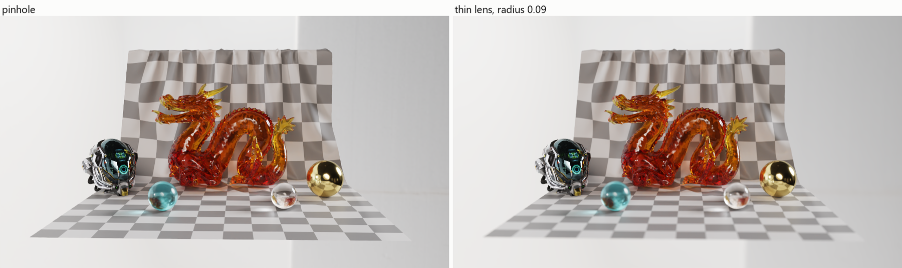</p>

*Pinhole (left) vs aperture radius 0.09 focused on the dragon (right), 1024 spp, denoised.*

**GPU vs CPU:** identical arithmetic per ray; it parallelizes perfectly. **Further work:** polygonal apertures
for shaped bokeh, and tilt-shift by rotating the focal plane.

## Textures, normal maps and bump mapping

* **Image textures** become CUDA texture objects (RGBA8 arrays, hardware bilinear filtering, wrap addressing).
  glTF embedded images supply base color (sRGB, decoded after filtering), metallic-roughness, normal and
  emissive maps; scene files can attach `TEXTURE` and `NORMAL_MAP` images to any material, with `UV_SCALE` tiling.
* **Procedural textures**: UV checker and three solid textures evaluated from the object-space hit point -
  marble (a sine wave distorted by 5 octaves of turbulence), wood (noisy rings) and fractal gradient noise (my own
  3D Perlin-style implementation with hashed gradients).
* **Normal mapping** uses mesh tangents (from glTF, or generated per vertex from UVs) or analytic tangents for
  spheres and cubes. **Bump mapping** tilts the shading normal against the gradient of a procedural height field,
  estimated with finite differences in the tangent plane. Shading normals that end up facing away from the viewer
  fall back to the geometric normal, and sampled directions on the wrong side of the true surface are discarded
  to avoid light leaks.

<p align="center"></p>

*Floor: image texture + normal map. Spheres, left to right: image texture + normal map, procedural marble,
procedural wood, hammered copper (procedural bump map on a GGX conductor).*

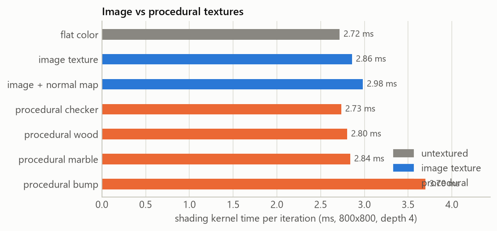

<details><summary>Data: texture shading cost</summary>

| material | iteration (ms) | shading kernel (ms) |
|---|---|---|
| flat color | 5.77 | 2.72 |
| image texture | 5.84 | 2.86 |
| image + normal map | 6.00 | 2.98 |
| procedural checker | 5.78 | 2.73 |
| procedural wood | 5.85 | 2.80 |
| procedural marble | 5.87 | 2.84 |
| procedural bump | 6.80 | 3.70 |

</details>

The test fills an 800x800 frame with one textured quad (4 bounces), so the shading kernel is dominated by the
texture. A filtered texture fetch costs about as much as five octaves of gradient noise here (+0.1 ms per
iteration); the bump map is the expensive one (+1.0 ms) because it evaluates the 4-octave height field three
times for the finite differences. Image textures are cheap thanks to the texture cache: neighbouring pixels fetch
neighbouring texels. **GPU vs CPU:** textures are where the GPU has dedicated hardware (filtering units and a
texture cache); a CPU pays for bilinear filtering in software, while procedural noise costs the same ALU work on
both. **Further work:** mip-mapping with ray differentials (no texture aliasing at a distance, better cache
hit rates), and analytic noise derivatives so bump mapping needs one evaluation instead of three.

## Environment lighting, next event estimation and MIS

* **Environment maps**: equirectangular HDR images (float4 texture objects, `ROTATION`, `INTENSITY`) or a
  constant color. Importance sampling uses a piecewise-constant 2D distribution over `luminance * sin(theta)`
  (marginal CDF over rows, conditional CDF per row, binary searches on the GPU).
* **Area lights**: every emissive sphere, cube and triangle goes into a light list, selected proportionally to
  power. Spheres are sampled inside the cone they subtend (no wasted back-side samples), cubes and triangles by
  area. Textured emitters (the helmet's glowing visor) are estimated per triangle on the CPU, so black regions of
  an emissive texture are never sampled. Environment vs area lights are split by estimated incident flux.
* **Next event estimation**: at every non-delta bounce the shading kernel samples a light, evaluates the BSDF
  for that direction and writes a shadow ray (origin, direction, distance, contribution) into the path's slot. A
  separate kernel traces all shadow rays with an any-hit BVH query, so the shading kernel stays free of
  traversal code.
* **Multiple importance sampling**: light samples and BSDF samples that hit an emitter or escape to the
  environment are both weighted with the power heuristic, using each strategy's solid-angle pdf for the other's
  direction.

<p align="center">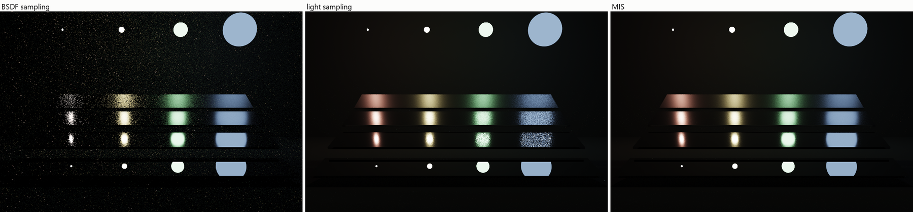</p>

*64 samples per pixel. Plates get rougher from front to back; lights grow from left to right with equal power.
BSDF sampling (left) cannot find the small lights in the rough plates; light sampling (middle) is noisy for the
big light in the sharp plates; MIS (right) handles every combination.*

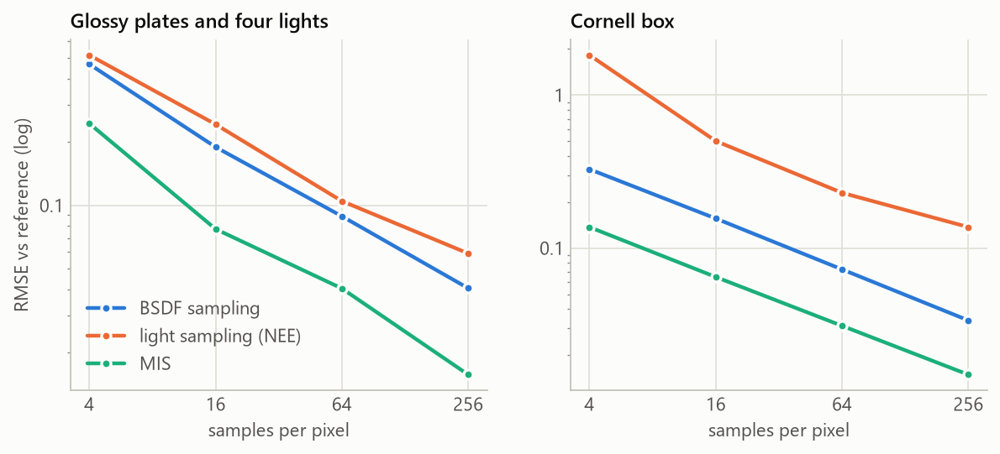

<details><summary>Data: RMSE vs 16384 spp MIS reference</summary>

**Glossy plates**

| spp | BSDF sampling RMSE | light sampling (NEE) RMSE | MIS RMSE |
|---|---|---|---|
| 4 | 0.4683 | 0.5169 | 0.2449 |
| 16 | 0.1892 | 0.2425 | 0.0772 |
| 64 | 0.0888 | 0.1048 | 0.0403 |
| 256 | 0.0404 | 0.0591 | 0.0157 |

**Cornell box**

| spp | BSDF sampling RMSE | light sampling (NEE) RMSE | MIS RMSE |
|---|---|---|---|
| 4 | 0.3278 | 1.8265 | 0.1372 |
| 16 | 0.1562 | 0.5011 | 0.0648 |
| 64 | 0.0726 | 0.2298 | 0.0310 |
| 256 | 0.0337 | 0.1372 | 0.0149 |

**Time per iteration**

| strategy | veach_mis (ms) | cornell (ms) |
|---|---|---|
| BSDF sampling | 5.69 | 9.27 |
| light sampling (NEE) | 7.19 | 11.88 |
| MIS | 7.16 | 11.96 |

</details>

MIS costs 25-30% more time per sample (the shadow ray pass) but has 2.3-2.6x lower RMSE at equal samples in both
scenes, roughly a 5x gain in efficiency. In the Cornell box, light sampling *alone* is worse than BSDF sampling:
the light cube intersects the ceiling, so ceiling points arbitrarily close to it receive light samples with an unbounded `1/r^2` term that
then propagates as fireflies. MIS assigns those samples a weight near zero because their light pdf in solid angle
is tiny compared to the BSDF pdf.

<p align="center"></p>

*Environment lighting only (Venice sunset HDRI), 3000 spp, denoised, shallow depth of field.*

**GPU vs CPU:** splitting shadow rays into their own kernel is a GPU-specific win (smaller shading kernel, shadow
rays run with the traversal-only register footprint). On a CPU one would trace the shadow ray inline.
**Further work:** a light BVH or ReSTIR-style resampling for scenes with thousands of emissive triangles
(selection is currently proportional to power only), and two-sided/one-sided emission control.

## Low-discrepancy sampling: Owen-scrambled Sobol

Every random number comes from `sample1D/2D(pixel, iteration, dimension)`, with a fixed dimension layout per path
(pixel jitter, lens, time, then 8 dimensions per bounce). The Sobol sampler follows Burley's *Practical Hash-based
Owen Scrambling* (2020): each 2D pair uses the first two Sobol dimensions (a (0,2)-sequence); the sample index is
shuffled and the point is Owen-scrambled with hashes of (pixel, dimension), which decorrelates pixels and
dimensions while keeping each pair stratified.

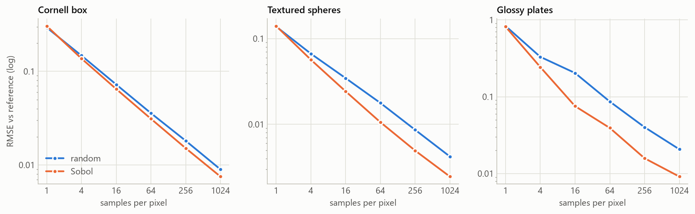

<details><summary>Data: RMSE vs 32768 spp reference</summary>

**Cornell box**

| spp | random RMSE | Sobol RMSE |
|---|---|---|
| 1 | 0.2943 | 0.3057 |
| 4 | 0.1475 | 0.1372 |
| 16 | 0.0724 | 0.0648 |
| 64 | 0.0357 | 0.0311 |
| 256 | 0.0181 | 0.0151 |
| 1024 | 0.0090 | 0.0075 |

**Textured spheres**

| spp | random RMSE | Sobol RMSE |
|---|---|---|
| 1 | 0.1382 | 0.1403 |
| 4 | 0.0666 | 0.0567 |
| 16 | 0.0346 | 0.0243 |
| 64 | 0.0178 | 0.0106 |
| 256 | 0.0086 | 0.0049 |
| 1024 | 0.0042 | 0.0025 |

**Glossy plates**

| spp | random RMSE | Sobol RMSE |
|---|---|---|
| 1 | 0.8341 | 0.8159 |
| 4 | 0.3303 | 0.2433 |
| 16 | 0.2036 | 0.0754 |
| 64 | 0.0864 | 0.0392 |
| 256 | 0.0401 | 0.0158 |
| 1024 | 0.0207 | 0.0091 |

</details>

The gain depends on how much of the image comes from low-dimensional integrals: at 1024 spp Sobol has 2.3x lower
RMSE on the glossy plates (mostly direct light; about 5x fewer samples for the same error), 1.7x on the
textured spheres, and 16% in the Cornell box, where deep diffuse interreflection makes the integrand
high-dimensional. The cost is a few integer operations per sample (no measurable change).

<p align="center">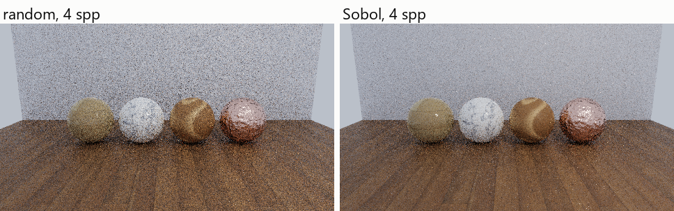</p>

*4 spp, random (left) vs Sobol (right).*

**GPU vs CPU:** both are stateless, so either suits GPUs; per-thread RNG state (the base code's thrust engine)
would cost registers and memory. **Further work:** padding higher Sobol dimensions jointly (4D for lens + pixel),
and blue-noise screen-space error distribution (Heitz & Belcour 2019).

## Motion blur

Objects can declare a world-space `MOTION` displacement over the exposure. Each camera path picks one shutter time
(its own sampler dimension) that all of its rays carry, including shadow rays. Intersection offsets the ray origin
by `-motion * time` before the object-space transform, light sampling moves emitters the same way, and world
bounds cover the whole sweep so bounding-box culling stays conservative.

<p align="center">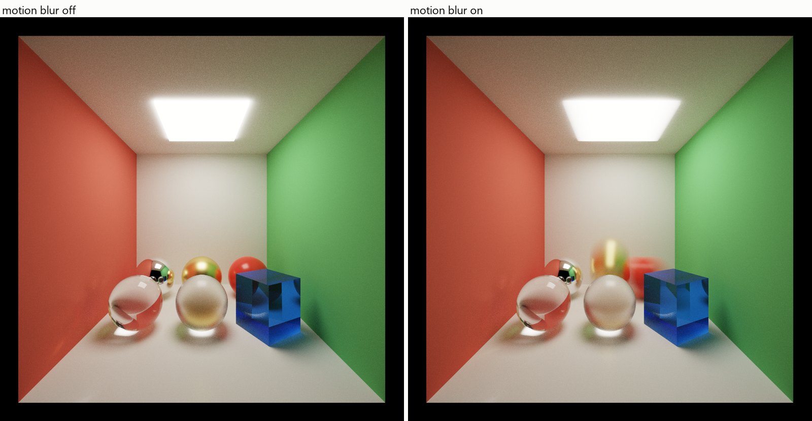</p>

*Motion off (left) and on (right): the gold sphere moves up, the red plastic sphere and the ceiling light move
sideways. 3000 spp.*

**Performance:** no measurable cost in this scene (11.96 vs 11.97 ms per iteration); the swept bounds only matter
when they make culling less effective. Because meshes are instances traversed in object space, moving meshes work
the same way without touching their BVHs. **GPU vs CPU:** no difference in approach; time is just one more random
dimension. **Further work:** rotation and scale keyframes (interpolated transforms per ray), and deforming meshes,
which would need BVH refits per time step.

## glTF / OBJ meshes and the BVH

* **Loading**: glTF 2.0 (`.gltf`/`.glb`) through tinygltf, walking the node hierarchy and baking node transforms;
  positions, normals, UVs and tangents (generated with Lengyel's method when missing); metallic-roughness
  materials with the emissive strength, IOR, transmission and volume extensions. OBJ through tinyobjloader with
  MTL diffuse color/texture. Meshes referenced twice are loaded once and instanced.
* **BVH**: built on the CPU per mesh with **binned SAH** (16 bins per axis, configurable leaf size and depth).
  Triangles are stored in leaf order as float4 `(v0, e1, e2)` triples so one leaf is a contiguous run of
  128-bit loads, and nodes are 32 bytes (`aabbMin, leftFirst, aabbMax, count`) with both children adjacent.
* **Traversal** is iterative with a 64-entry stack: both child boxes are tested, the nearer child is visited
  first, and the farther one is pushed with its entry distance so it is skipped if a closer hit is found
  before it is popped. Shadow rays use an any-hit variant that returns on the first hit.
* **Two levels**: the top level is a flat loop over objects with optional world-space bounding box culling; each
  mesh is traversed in its own object space, so instances share one BVH.

<p align="center"></p>

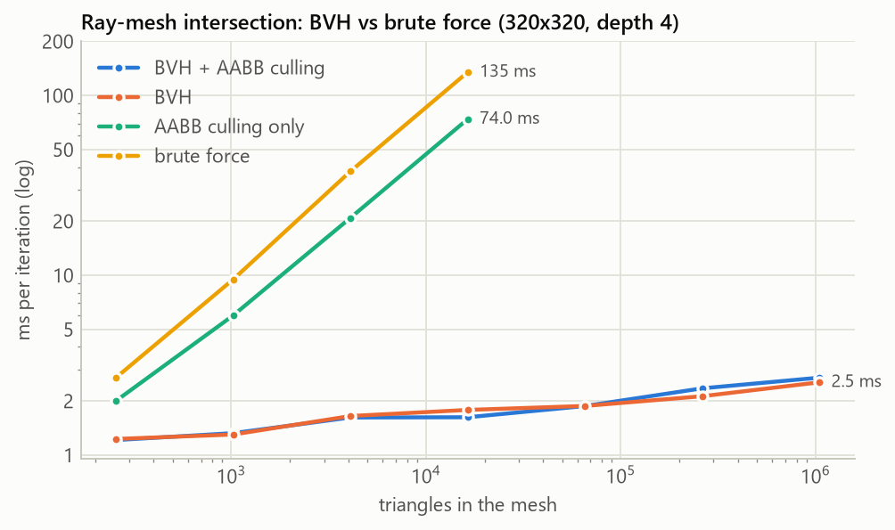

<details><summary>Data: ms per iteration vs triangle count</summary>

| triangles | BVH + AABB culling (ms) | BVH (ms) | AABB culling only (ms) | brute force (ms) |
|---|---|---|---|---|
| 256 | 1.21 | 1.23 | 2.00 | 2.70 |
| 1024 | 1.32 | 1.30 | 5.99 | 9.50 |
| 4096 | 1.62 | 1.65 | 20.89 | 37.89 |
| 16384 | 1.62 | 1.78 | 73.96 | 134.92 |
| 65536 | 1.88 | 1.88 | - | - |
| 262144 | 2.35 | 2.13 | - | - |
| 1048576 | 2.70 | 2.54 | - | - |

</details>

The test renders a tessellated sphere of 256 to 1M triangles. Brute force scales linearly (16k triangles: 135 ms
per iteration) and bounding-box culling only helps rays that miss the mesh. With the BVH the cost grows
logarithmically: **1M triangles render in 2.5 ms per iteration, 53x faster than brute force on just 16k
triangles**. Brute force beyond 16k triangles was not run: a single bounce would exceed the Windows GPU watchdog.
All four modes produce bit-identical images.

The BVH cost heatmap (`--save-bvh-cost`, or *Show: BVH cost* in the UI) shows box + triangle tests of the camera
ray through each pixel, light = cheap, dark = 160+ tests:

<p align="center">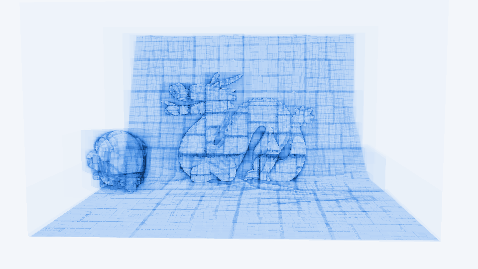</p>

*Cover scene, 960x540: 24.3 box tests and 2.4 triangle tests per camera ray on average. Silhouettes and grazing
angles on the cloth are the expensive regions: rays there pass close to many boxes without hitting their
triangles.*

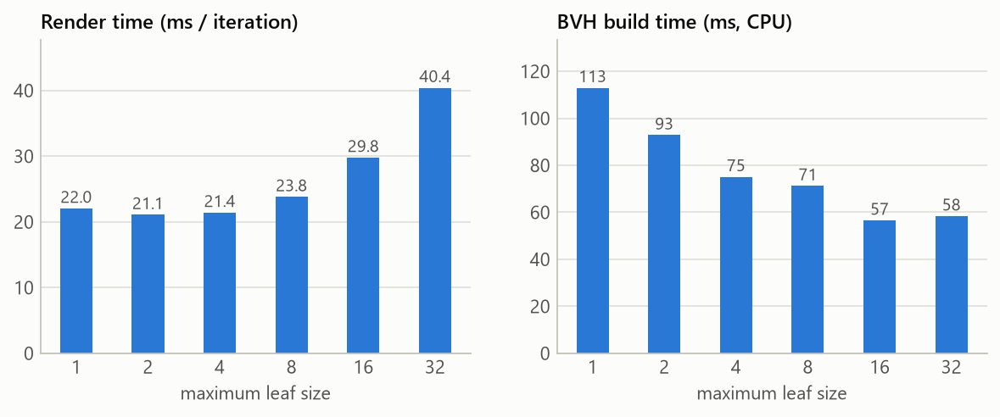

<details><summary>Data: leaf size sweep on the cover scene (960x540)</summary>

| max leaf size | ms / iteration | build (ms) | nodes | depth |
|---|---|---|---|---|
| 1 | 22.0 | 113 | 295834 | 25 |
| 2 | 21.1 | 93 | 176322 | 24 |
| 4 | 21.4 | 75 | 98752 | 23 |
| 8 | 23.8 | 71 | 52602 | 22 |
| 16 | 29.8 | 57 | 27352 | 20 |
| 32 | 40.4 | 58 | 13982 | 19 |

</details>

Leaves of 2-4 triangles are best on this GPU; larger leaves test many more triangles per ray (leaf 32: twice the
time), while single-triangle leaves triple the node count of 4-triangle leaves and lengthen traversal. The build (~75 ms for the
cover scene's 150k triangles) is negligible; checkpoints store the built BVH anyway.

**GPU vs CPU:** BVH traversal is the GPU's weak spot: the stack lives in local memory and rays in a warp diverge
in their traversal order. A CPU traverses one ray with perfect branch prediction per ray but has far less
parallelism; production CPU renderers use 4- or 8-wide BVHs with SIMD box tests. **Further work:** a wider
(BVH4/8) layout with compressed child boxes, ray reordering by direction, a short stack in shared memory, and the
RT cores of the RTX 2050 through OptiX.

## Russian roulette

From bounce 3 on (configurable), a path survives with probability `min(1, max(throughput))` and survivors are
divided by that probability, so the estimator stays unbiased (image means with and without roulette agree to
0.007% at 300 spp).

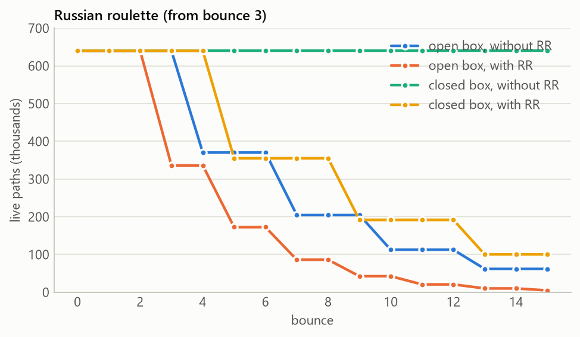

<details><summary>Data: iteration time with and without roulette (depth 16)</summary>

| scene | RR off (ms) | RR on (ms) |
|---|---|---|
| open box | 21.9 | 16.6 |
| closed box | 41.9 | 25.7 |

</details>

Roulette makes the open box 24% faster and the **closed box 39% faster**: in a closed scene nothing escapes, so
without roulette every path runs all 16 bounces even after its throughput has dropped to a few percent.
With roulette, paths in a closed scene do terminate, which gives compaction something to remove. **GPU vs CPU:** on a CPU roulette saves the same
work; on the GPU it additionally needs compaction, otherwise killed paths just idle in their warps.
**Further work:** splitting high-throughput paths (the opposite of roulette) and roulette weighted by the
expected contribution rather than the raw throughput.

## Wavefront material queues

Instead of sorting, a classify kernel appends every live path to the queue of its material *type* (diffuse,
conductor, dielectric, metallic-roughness, emitter, miss) with warp-aggregated atomics (`__match_any_sync` groups
the lanes going to the same queue, one `atomicAdd` per group), and one kernel per non-empty queue shades it.
The shading code is a template on the material type, so each queue kernel is specialized at compile time: the
BSDF `switch` folds away, and the miss and emitter kernels shrink from 96 to 33 and 48 registers.

The results are in the [material sorting chart](#sorting-paths-by-material): wavefront queues behave like index
sorting (the classify pass is ~1.6-2.5 ms, cheaper than any sort but not free) and only win in the textured
scene. The surface kernels stay at ~95 registers because texture and procedural evaluation dominate the shading
code, so specialization by BSDF type does not raise occupancy. **GPU vs CPU:** queues exist only to keep SIMT
lanes doing the same work. **Further work:** split queues by *texture* cost instead of BSDF type, and give each
queue a structure-of-arrays copy of the path state so its kernel reads coalesced memory (Laine et al. 2013).

## Denoising with Open Image Denoise

The shading kernel records denoiser features once per path: albedo and shading normal of the first surface that
is not a perfect mirror or glass (those pass through to what they show), the emission color for lights, and the
environment for misses. OIDN runs on a **CUDA device sharing the renderer's default stream** and reads the
averaged accumulation buffers in place (`oidnNewSharedBuffer`), so nothing is copied to the host; a CPU device is
the fallback. Guides can optionally be prefiltered (denoised first) and the filters are committed once and cached.
In the interactive viewer the image is denoised every N iterations; headless runs write `*.denoised.png`.

<p align="center">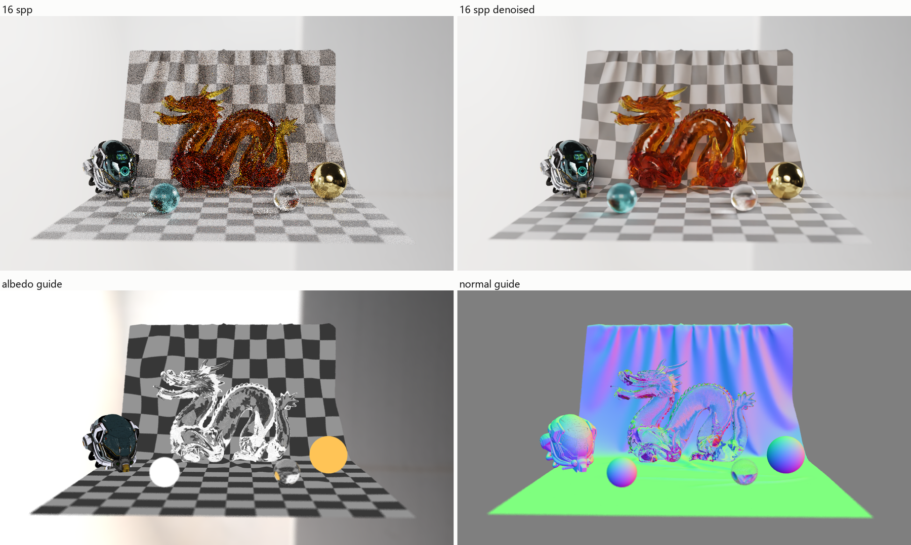</p>

*16 samples per pixel (960x540): path traced, denoised (albedo + normal, prefiltered), and the two guide images.*

<p align="center">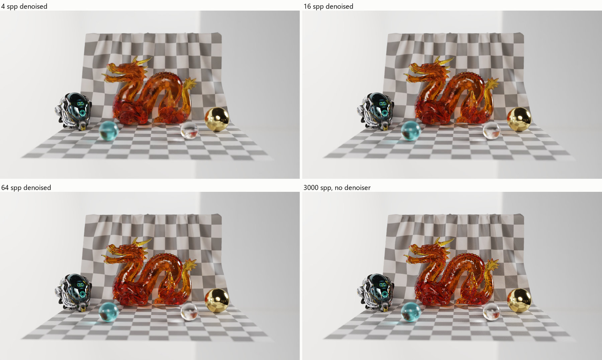</p>

*Denoised at 4, 16 and 64 spp, and the 3000 spp render for reference.*

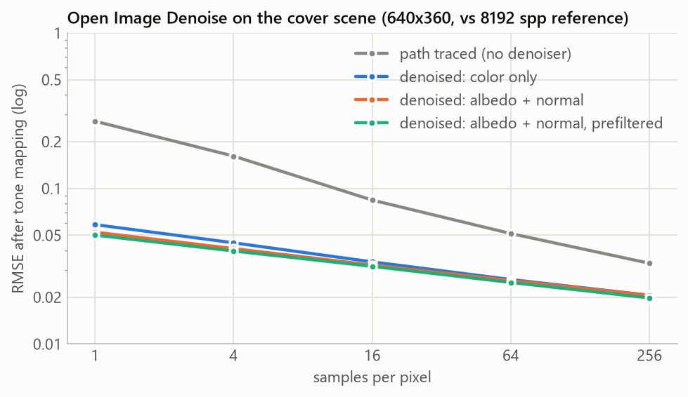

<details><summary>Data: display-space RMSE (ACES + gamma) vs 8192 spp reference</summary>

| spp | raw RMSE | denoised: color only | denoised: albedo + normal | denoised: albedo + normal, prefiltered |
|---|---|---|---|---|
| 1 | 0.2708 | 0.0586 | 0.0524 | 0.0502 |
| 4 | 0.1616 | 0.0447 | 0.0411 | 0.0396 |
| 16 | 0.0842 | 0.0337 | 0.0322 | 0.0316 |
| 64 | 0.0513 | 0.0260 | 0.0256 | 0.0249 |
| 256 | 0.0330 | 0.0206 | 0.0205 | 0.0198 |

</details>

Measured after tone mapping (what the viewer sees), 4 denoised samples have lower error than 64 raw samples, and
16 denoised samples match 256. The albedo and normal guides lower the error at every sample count, most at the
lowest (15% at 1 spp); prefiltering them helps a little more, because first-hit features are themselves noisy
at depth-of-field edges and behind glass. On the CUDA device a 640x360 denoise takes 9.5 ms (56 ms with prefiltered guides, which run two extra networks), and the 1600x900 cover took 348 ms in high-quality mode with prefiltering. Committing the filters (loading weights, building kernels) costs another 0.1-0.2 s once, so it happens at startup and the filters are cached. **GPU vs CPU:** OIDN's CPU device needs the color and guide buffers copied to the host and the result copied back every time
and runs the network on the CPU cores; the CUDA device keeps everything on the GPU and makes interactive
denoising practical. **Further work:** temporal accumulation of the guides, and denoising only when the camera
stops instead of every N iterations.

## Restartable rendering

A checkpoint (`*.ptstate`) stores the complete scene - geometry, per-mesh BVHs, materials, decoded textures, the
environment map with its sampling tables and the light list - plus the camera orbit state, render settings and
the accumulated radiance and denoiser features. Passing the file instead of a scene file resumes rendering
without the original assets or any BVH build. Save with **P**, the ImGui button, `--save-state`, or periodically
with `--checkpoint N`.

Because every sample is a pure function of (pixel, iteration, dimension), **a render that is stopped at 32 spp
and resumed to 64 spp is bit-identical to an uninterrupted 64 spp render** (verified with `scripts/imgdiff.py`
on the helmet/sunset scene, resumed from a different directory). For the cover scene a checkpoint is 172 MB, mostly the decoded helmet textures and the float environment map with its sampling tables; writing it takes about 0.1 s, and starting from it takes 0.6 s instead of 1.1 s from the scene file (no glTF decoding or BVH builds; both include CUDA initialization).
**Further work:** compress the checkpoint (most of it is texture and environment data that could be referenced
by path and hash instead of copied).

## Validation

* **White furnace test** (`scripts/furnace.py`): a sphere inside a uniform white environment must vanish if its
  BSDF conserves energy and its sampling weights are right.

  | material | sphere radiance (should be 1) |
  |---|---|
  | diffuse | 1.0000 |
  | mirror | 1.0000 |
  | GGX metal, roughness 0.3 / 0.8 | 0.986 / 0.763 (single-scattering energy loss, expected) |
  | smooth glass | 1.0000 |
  | rough glass, roughness 0.3 | 0.968 |
  | metallic-roughness dielectric / metal | 1.012 / 0.996 |

* **Unbiasedness**: BSDF sampling, NEE and MIS converge to the same image (mean radiance within 0.3% at 1024 spp;
  0.2% with an environment map); Russian roulette changes the mean by 0.007%.
* **Order independence**: stream compaction on/off, every sort mode, BVH vs brute force and bounding-box culling
  on/off all produce bit-identical images. The template-specialized wavefront kernels are equivalent but not
  bit-identical, because the compiler contracts floating-point expressions differently: on the cover scene 95% of
  pixels match exactly (99.99% in the materials box), almost all others differ in the last bits, and in 0.26% a
  rounding difference flips a discrete choice (e.g. Fresnel reflect vs refract) so that path takes another, equally
  valid route. Image means agree to five digits.
* **Resume**: a resumed checkpoint matches the uninterrupted render exactly.

## Bloopers

<p align="center">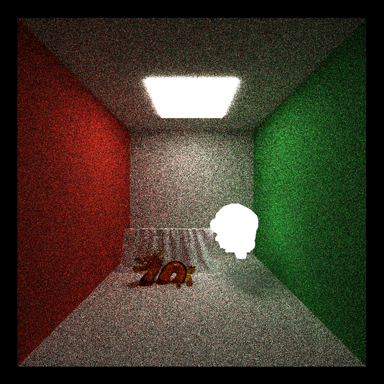 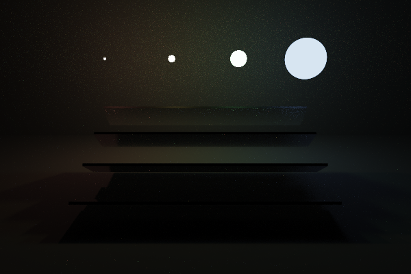</p>

*Left: the first glTF test, before textures. The helmet has an emissive factor of 1 that is meant to be
multiplied by a mostly-black emissive texture, so without the texture the whole helmet became a light.
Right: the first attempt at the Veach scene; the plates were tilted by guesswork and only show their edges.
Computing each plate's tilt as the half-vector between the camera and the lights fixed it.*

## Credits and references

Third-party code (header-only, in `external/include`): [tinygltf](https://github.com/syoyo/tinygltf) (MIT),
[tinyobjloader](https://github.com/tinyobjloader/tinyobjloader) (MIT), [stb_image](https://github.com/nothings/stb)
(updated to v2.30 because tinygltf needs its 16-bit loaders); optional [Intel Open Image Denoise
2.5.1](https://github.com/RenderKit/oidn) (Apache 2.0). Thrust/CUB ship with CUDA. Assets and their licenses are
listed in [`scenes/CREDITS.md`](scenes/CREDITS.md): the Khronos DamagedHelmet and DragonAttenuation glTF samples,
Poly Haven textures and HDRIs (CC0).

* M. Pharr, W. Jakob, G. Humphreys, *Physically Based Rendering*, 3rd and 4th editions (dielectric BSDF, MIS,
  Russian roulette, light sampling).
* E. Heitz, *Sampling the GGX Distribution of Visible Normals*, JCGT 2018.
* B. Walter et al., *Microfacet Models for Refraction through Rough Surfaces*, EGSR 2007.
* B. Burley, *Practical Hash-based Owen Scrambling*, JCGT 2020.
* E. Veach, L. Guibas, *Optimally Combining Sampling Techniques for Monte Carlo Rendering*, SIGGRAPH 1995.
* J. Bikker, *How to build a BVH* series (2022) - binned SAH construction and near-first traversal.
* S. Laine, T. Karras, T. Aila, *Megakernels Considered Harmful: Wavefront Path Tracing on GPUs*, HPG 2013.
* T. Duff et al., *Building an Orthonormal Basis, Revisited*, JCGT 2017.
* K. Narkowicz, *ACES Filmic Tone Mapping Curve* (2016).

## Build and CMake changes

* New sources: `bvh`, `checkpoint`, `denoiser`, `meshLoader` (.cpp/.h) and headers `lights.h`, `mathUtils.h`,
  `postprocess.h`, `sampler.h`, `textures.h`. `intersections.cu`/`interactions.cu` were folded into their headers
  so the device code can be inlined.
* `cuda-temp.props` is attached as `VS_USER_PROPS` on MSVC: Visual Studio passes `TEMP`/`TMP` to nvcc, and a user
  profile path with spaces makes nvcc fail; the props file points them at a build-local directory.
* Optional OIDN detection (`OIDN_ROOT`, defaults to `external/oidn`) that defines `USE_OIDN`, links the import
  library and copies the runtime DLLs after the build.

Fixes to the base code: the scene loader derived the camera's right vector before setting its view direction;
the orbit camera lost the sign of the initial azimuth (cameras at negative x were mirrored) and used an
unnormalized right vector for non-horizontal views; `Image` freed its pixel array with `delete` instead of
`delete[]`; and a camera move re-uploaded the whole scene instead of just clearing the accumulation buffer.
